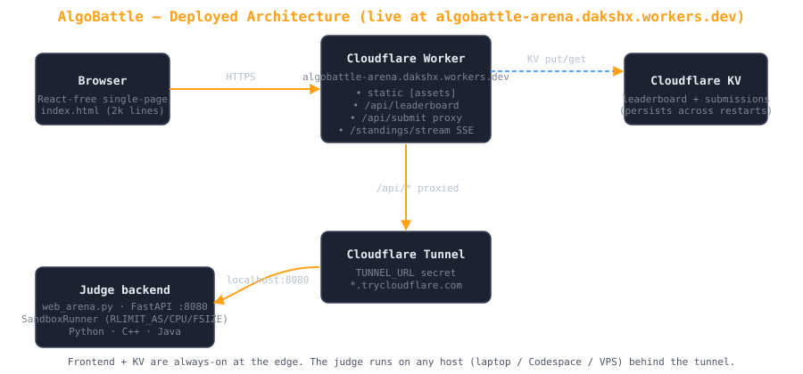

# AlgoBattle

A competitive coding platform (LeetCode / Codeforces style) for the GDG VIT Chennai speed-coding event. Participants pick a problem, write Python / C++ / Java in an in-browser editor, get instant feedback against sample cases (**Run**), then submit against the full hidden test suite (**Submit**). The judge runs code in a sandbox, measures efficiency, and ranks everyone on a live leaderboard.

**Live at:** [`https://algobattle-arena.dakshx.workers.dev/`](https://algobattle-arena.dakshx.workers.dev/)



---

## Table of Contents

1. [How the project works](#how-the-project-works)
2. [Tech stack](#tech-stack)
3. [Repository layout](#repository-layout)
4. [Getting started](#getting-started)
5. [How judging works](#how-judging-works)
6. [Edge case handling](#edge-case-handling)
7. [Authentication & access control](#authentication--access-control)
8. [Problems encountered & mitigations](#problems-encountered--mitigations)
9. [Testing (TDD + BDD)](#testing-tdd--bdd)
10. [Deployment](#deployment)
11. [Cost & scalability](#cost--scalability)
12. [Known limitations](#known-limitations)
13. [Further reading](#further-reading)

---

## How the project works

### The deployed architecture (what's live)

```
Browser
   │  HTTPS
   ▼
Cloudflare Worker  →  algobattle-arena.dakshx.workers.dev
   │
   ├── [assets]   static frontend (single index.html, ~2k lines, no framework)
   ├── [KV]       /api/leaderboard, /api/submissions, /health  (always online)
   │
   └── /api/submit, /api/compiler/run, /api/problems/*, /standings/stream
        │
        ▼  (HTTPS, via TUNNEL_URL secret)
   Cloudflare Tunnel  →  *.trycloudflare.com
        │
        ▼  (localhost)
   Judge backend  →  web_arena.py on :8080 (FastAPI + SandboxRunner)
```

**Why this shape:** Cloudflare Workers cannot run subprocesses (no Python, no g++, no JVM), so the judge runs on a real host behind a tunnel. The frontend + leaderboard persist in Workers KV, so the site stays up (and the leaderboard stays readable) even when the judge is offline. When the judge is down, the Worker returns a graceful 502 with a clear message instead of a broken page.

### The production-scalable backend (also in this repo)

```
Browser → FastAPI (uvicorn) ── /api/* ──┐
   │                                      │
   ├── PostgreSQL ◀── users, problems, contests, submissions
   ├── Redis     ◀── RQ queue + ZSET leaderboard + pub/sub
   │
   └── enqueue ──▶ RQ worker(s)
                          │
                          ▼
                       Judge0 (Docker, IOI isolate sandbox)
                          │
                          ▼
                       per-testcase verdict → callback → WebSocket push
```

This is the "Path B" architecture in `backend/app/` — async SQLAlchemy, JWT auth, idempotent submission state machine, stuck-submission sweeper, rate limiting. It's code-complete and ready to deploy; the live site uses the simpler "Path A" (`web_arena.py`) for zero-cost hosting. **Both share the same Cloudflare edge** — swapping the judge backend is a one-line `TUNNEL_URL` change. See [`PROJECT_OVERVIEW.md`](PROJECT_OVERVIEW.md#1b-which-architecture-is-the-project-read-this-first) for the full comparison.

### Request lifecycle (live path)

1. User clicks **Submit** in the browser
2. Worker receives `POST /api/submit` at the edge
3. Worker forwards to `web_arena.py` via the tunnel
4. `web_arena.py` writes a submission record (also persisted to KV by the Worker)
5. `SandboxRunner` runs the code:
   - Python: `subprocess.Popen([python3, -u, tmp])`
   - C++: `g++ -O2` then exec
   - Java: `javac` + `java -Xmx256m ...`
   - RLIMIT_AS / RLIMIT_CPU / RLIMIT_FSIZE set before exec; wall-clock timer SIGKILLs the process group
6. Verdict + per-testcase results returned; Worker appends to KV
7. Leaderboard recomputed from KV (score desc, then efficiency asc)

### Request lifecycle (FastAPI path)

1. `POST /api/submissions` → Pydantic validates → JWT auth → rate limit check
2. `SubmissionService.submit` creates a `PENDING` row, enqueues an RQ job
3. Worker marks `RUNNING`, loads test cases (sample-only for `mode='test'`), sends to Judge0, polls
4. Persists per-testcase results, updates submission to terminal status, updates contest points + Redis ZSET
5. WebSocket pushes the status change live to the browser

---

## Tech stack

| Layer | Technology | Why |
|---|---|---|
| **Backend** | FastAPI + Python 3.11+ | Native async, Pydantic v2 validation, auto OpenAPI |
| **Database** | PostgreSQL 16 | ACID, async via SQLAlchemy 2 |
| **Cache + Queue** | Redis 7 + RQ | ZSET leaderboard, job queue, pub/sub |
| **Sandbox (live)** | In-house `SandboxRunner` | RLIMIT_AS/CPU/FSIZE + wall-clock kill, zero deps |
| **Sandbox (prod)** | Judge0 + IOI `isolate` | Kernel-level cgroups isolation, 90+ languages |
| **Frontend** | Single-file HTML/CSS/JS | Zero build step, deployable as static asset |
| **Edge** | Cloudflare Worker + KV + Tunnel | Always-on static, persistent leaderboard, free tier |
| **Monitoring** | Prometheus + Grafana + Loki | Metrics, dashboards, logs |
| **CI/CD** | GitHub Actions | Ruff, pytest, Docker build/push |
| **IaC** | Terraform (AWS) + Helm (EKS) | Declarative infra, HPA, PDBs |
| **VS Code extension** | TypeScript + esbuild | Submit / run / browse from the editor |

---

## Repository layout

```
algobattle/
├── backend/
│   ├── app/                    # FastAPI backend (Path B — production-scalable)
│   │   ├── main.py             # App factory + lifespan
│   │   ├── config.py           # pydantic-settings + production-safety validator
│   │   ├── core/               # security (JWT/bcrypt), exceptions, pagination, ws_router
│   │   └── modules/            # users / problems / contests / submissions / leaderboard
│   │       └── submissions/
│   │           ├── tasks.py    # Judge worker (idempotent state machine)
│   │           ├── checker.py  # Stuck-submission sweeper (every 60 s)
│   │           └── judge_client.py
│   ├── sandbox/                # Live judge (Path A)
│   │   ├── web_arena.py        # FastAPI app on :8080 (deployed)
│   │   ├── sandbox_runner.py   # Subprocess sandbox (Python/C++/Java)
│   │   ├── Dockerfile          # Production judge image
│   │   └── deploy/             # Cloudflare Worker + KV + tunnel + VPS setup
│   ├── tests/                  # TDD + BDD + integration + comprehensive
│   ├── migrations/             # Alembic schema
│   └── pyproject.toml
├── docs/                       # ARCHITECTURE, SECURITY, RUNBOOK, COST, DEPLOY_*
│   └── architecture_*.svg      # Diagrams
├── extension/                  # VS Code extension (TypeScript)
├── infra/                      # Docker Compose, Helm, Terraform, GitHub Actions
├── .devcontainer/              # GitHub Codespaces setup (1-click)
├── ISSUES.md                   # Every issue ever hit + mitigation
├── PROJECT_OVERVIEW.md         # Single source of truth (540 lines)
└── README.md                   # This file
```

---

## Getting started

### One-command demo (what the live site does)

**You need two terminals.** Terminal 1 runs the judge + tunnel; Terminal 2 points the Cloudflare Worker at it.

**Terminal 1 — start the judge + tunnel (keep running):**

```bash
# 1. Start the judge on your machine
cd backend && .venv/bin/python sandbox/web_arena.py
# → FastAPI on 127.0.0.1:8080, sandbox online

# 2. In a SECOND terminal, expose it with a free Cloudflare quick tunnel
cloudflared tunnel --url http://127.0.0.1:8080
# → prints something like: https://random-words.trycloudflare.com
#    COPY this URL — you'll paste it in step 3.
```

**Terminal 2 — point the deployed Worker at the tunnel (run once):**

```bash
# 3. Point the deployed Worker at the tunnel
cd backend/sandbox/deploy/worker
wrangler secret put TUNNEL_URL
#    paste the trycloudflare URL from step 2, press Enter
#    (wrangler may pause for ~30s — that's normal, wait for "Success")
wrangler deploy

# 4. Open the live site and submit a solution
open https://algobattle-arena.dakshx.workers.dev/
```

> **Heads up:** the quick-tunnel URL changes every time you restart `cloudflared`. If the live site stops responding, redo step 2 + 3 (or use a named tunnel — see `backend/sandbox/deploy/vps-setup.md` for a persistent setup).

### Local development (FastAPI backend)

```bash
cd backend
cp .env.example .env              # set POSTGRES_PASSWORD, JWT_SECRET
alembic upgrade head              # create tables
python -m app.modules.problems.data.seed
uvicorn app.main:app --reload     # API on :8000

# In another shell
rq worker algobattle-judge --url redis://localhost:6379/0
```

### GitHub Codespaces (free, no card)

Open the repo in a Codespace — `.devcontainer/` auto-installs compilers, Python deps, and forwards port 8080. Then `python sandbox/web_arena.py`. Full guide: [`backend/sandbox/deploy/CODESPACES.md`](backend/sandbox/deploy/CODESPACES.md).

---

## How judging works

### Verdicts

| Verdict | Meaning | How detected |
|---|---|---|
| **AC** | All tests passed | stdout == expected on every case |
| **WA** | Wrong output | stdout != expected |
| **TLE** | Time limit exceeded | wall-clock timer SIGKILLs process group |
| **MLE** | Memory limit exceeded | RLIMIT_AS breach (Linux) or OOM-kill detection |
| **RE** | Runtime error | non-zero exit code (division by zero, index error, recursion) |
| **OLE** | Output limit exceeded | RLIMIT_FSIZE → SIGXFSZ |
| **CE** | Compile error | g++/javac non-zero exit |

### Scoring

- First **AC** on a problem: +100 points (ICPC-style, minus 20 per prior wrong submission, floor 0)
- Failed attempts: −20 penalty (capped so score never goes below 0)
- Leaderboard sorted by **score desc**, ties broken by **total solve time asc**

### Determinism

The sandbox is deterministic for a given input — `sum(range(100))` returns `4950` every time, verified across 5 runs. Determinism is what makes the leaderboard fair under load.

---

## Edge case handling

### Submission state machine (FastAPI path)

```
PENDING → RUNNING → ACCEPTED
                   ├── WRONG_ANSWER
                   ├── TIME_LIMIT_EXCEEDED
                   ├── MEMORY_LIMIT_EXCEEDED
                   ├── RUNTIME_ERROR
                   ├── COMPILE_ERROR
                   └── INTERNAL_ERROR
```

- **Idempotency:** the worker rechecks `status in TERMINAL_STATUSES` before grading — a re-enqueued job is a no-op, so double-pickup is safe
- **Worker crash mid-grading:** the APScheduler sweeper re-enqueues anything non-terminal older than 60 s
- **Judge0 outage (prod):** submission is marked `INTERNAL_ERROR` and retried by the sweeper — **never** silently falls back to an unsandboxed local runner (that's a dev-only opt-in)
- **Judge backend offline (live path):** Worker returns graceful 502; KV leaderboard stays readable

### Sandbox disruption handling (verified via TDD + BDD)

| Disruption | Result |
|---|---|
| `while True: pass` | TLE (wall-clock kill) |
| `def f(): return f()` | RE (RecursionError) |
| `1 / 0` | RE |
| `arr[99]` | RE |
| Memory bomb | MLE / TLE / RE (accepted alternatives) |
| `print("x" * 200000)` | OLE / RE |

### Concurrency

- Two workers racing on the same submission: safe (idempotency check)
- Two AC submissions for the same problem: only the first grants points (checked via query)
- SQL + Redis ZSET divergence on worker death: documented as an open issue (needs a reconciliation sweeper)

### Input validation

- Code length: 1–100 KB (Pydantic)
- Per-testcase output: capped at 8 KB stored
- Languages: Python, C++, Java (unknown → defaults to Python, logged)
- Duplicate registration: 409 with a generic message (doesn't leak which field is taken)
- Unknown problem / contest / submission: 404

---

## Authentication & access control

### Registration & login

- `POST /api/auth/register` — username (3–32 chars, `[a-zA-Z0-9_.-]`), RFC-valid email, password 8–128 chars; bcrypt hash (cost 12); 201
- `POST /api/auth/login` — username-or-email + password; JWT (HS256, 24 h); 200. **Generic error** on bad creds (no user-enumeration)

### JWT

- `sub` = user id, `iat` + `exp` set; HS256 with a secret from env
- **Production startup validator** refuses to boot if `JWT_SECRET` is still the repo default (`dev-secret-change-me`) — fail fast instead of shipping a known signing key

### Authorization model

| Endpoint | Auth | Access |
|---|---|---|
| `GET /api/problems`, `/api/contests`, leaderboards | none | Public read |
| `POST /api/problems`, `/api/contests` | JWT | **Admin only** (403 otherwise) |
| `POST /api/auth/*` | none | Open (registration gated by env flag) |
| `POST /api/submissions` | JWT | Any logged-in user, 30/min rate limit |
| `GET /api/submissions/{id}`, `{id}/results` | JWT | **Owner only** — 404 on someone else's submission (no existence leak) |
| `POST /api/contests/{id}/join` | JWT | Any logged-in user, only during the contest window |

**Admin elevation is only possible via direct DB write** — no admin-promotion endpoint exists, so there's no privilege-escalation path through the API.

### Live path (web_arena.py)

- Simple token auth (`ADMIN_KEY` env for admin; per-participant tokens)
- `X-Token` header resolves participants; rate limit 10/min per participant

---

## Problems encountered & mitigations

The complete, chronological log is in [`ISSUES.md`](ISSUES.md) (7 parts). Highlights:

### Security & correctness (fixed in this project's recent work)

| Problem | Mitigation |
|---|---|
| **IDOR on submission read** — any user could read another user's code + stderr | `get_by_id_for_user()` returns 404 (not 403) on cross-user access |
| **SQL-injection-shaped pattern** in the stuck-submission checker (hand-built `IN (...)` string) | Rewrote with async ORM `select().where(status.notin_(...))` |
| **Silent Judge0 → unsandboxed local fallback in production** | Gated by `judge_allow_local_fallback`, forced **False** in production by a config validator |
| **Default JWT secret in production** | Config validator refuses to start in prod with the default |
| **Fire-and-forget `create_task` bug** — grading coroutine could be cancelled when the request returned | `judge_submission` raises if called from a running event loop; router always enqueues via RQ |
| **`/run` endpoint identical to `/submit`** (both ran hidden tests) | `/run` now forces `mode="test"` (sample cases only) |

### Sandbox engineering (from `ISSUES.md` Part A)

| Problem | Mitigation |
|---|---|
| `RLIMIT_AS` can't be lowered on macOS | Memory bombs caught by wall-clock kill → TLE (documented; Linux gives true MLE) |
| SIGALRM doesn't reach subprocess on macOS | `proc.wait(timeout)` + threading.Timer kill |
| Output flood could hang/fill disk | `RLIMIT_FSIZE` → SIGXFSZ → OLE (stdout redirected to a real file, not a pipe) |
| Java JVM dies in containers ("Could not reserve enough space") | 2 GB RLIMIT_AS + `-Xmx256m -XX:MaxMetaspaceSize=128m -XX:ReservedCodeCacheSize=64m` (real RSS ~35 MB) |
| C++/Java false TLE under parallel load | Compiled languages get 10 s wall budget (Python 3 s) |

### Deployment / free-hosting saga (from `ISSUES.md` Part E)

| Option | Verdict |
|---|---|
| Oracle Cloud Always Free (24 GB ARM) | Best specs, **requires a credit card** — out |
| GCP e2-micro | Requires a card for Free Trial signup — out |
| DigitalOcean via GitHub Student Pack | **Partnership ended July 31, 2026** — out |
| Fly.io | Free tier killed Oct 2024 — out |
| **Laptop + Cloudflare Tunnel** | **Used today** — free, no card, works for demo |
| **Azure for Students** | Best card-free always-on option ($100 credit, renewable) |

---

## Testing (TDD + BDD)

The project is TDD/BDD-first. **735 tests pass, 8 skipped** (skipped = API tests needing a live server).

```
735 passed | 8 skipped
├── TDD — Sandbox Runner         tests/tdd/test_sandbox_runner.py
├── BDD — Platform features      tests/bdd/test_bdd_features.py + .feature files
├── Unit — Modules               app/modules/*/tests/
├── Integration                  tests/test_integration.py
├── Comprehensive                tests/test_comprehensive.py
└── Live judge (web_arena)       sandbox/tests/test_web_arena.py
```

```bash
cd backend && .venv/bin/python -m pytest tests/ app/modules/ sandbox/tests/test_web_arena.py -v
```

**Coverage of edge cases:** TDD covers all 6 disruption scenarios (infinite loop, recursion, div-by-zero, index error, memory bomb, output flood) + determinism + performance. BDD covers the same as Gherkin scenarios plus auth, submission lifecycle, leaderboard, and stuck-submission recovery.

---

## Deployment

| Target | Guide | Cost |
|---|---|---|
| **Live now** (Cloudflare Worker + KV + tunnel) | [`backend/sandbox/deploy/README.md`](backend/sandbox/deploy/README.md) | $0 |
| VPS (24/7, named tunnel) | [`backend/sandbox/deploy/vps-setup.md`](backend/sandbox/deploy/vps-setup.md) | $0–5/mo |
| Codespaces (free, demo) | [`backend/sandbox/deploy/CODESPACES.md`](backend/sandbox/deploy/CODESPACES.md) | $0 |
| GCP (Cloud Run + SQL + Memorystore) | [`docs/DEPLOY_GCP.md`](docs/DEPLOY_GCP.md) | ~$82–165/mo |
| AWS (Terraform) | [`docs/DEPLOY_AWS.md`](docs/DEPLOY_AWS.md) | ~$125/mo |
| Azure (Container Apps) | [`docs/DEPLOY_AZURE.md`](docs/DEPLOY_AZURE.md) | ~$115–235/mo |
| Vercel + Railway | [`docs/DEPLOY_VERCEL.md`](docs/DEPLOY_VERCEL.md) | $0–15/mo |

---

## Cost & scalability

### Why this architecture scales

- **Stateless API** — FastAPI instances hold no session state; scale horizontally behind a load balancer by adding replicas (no sticky sessions needed).
- **Async everything** — SQLAlchemy 2 async + asyncpg + async Redis means a single uvicorn worker handles thousands of concurrent connections, so you need fewer instances for the same load.
- **Redis-backed leaderboard** — ZSET `O(log n)` inserts and range queries; ranking stays fast even with 10k+ participants. Ties broken by solve time via a second ZSET.
- **Job queue decouples judging from the API** — submissions are enqueued to RQ and graded by workers; a spike in submissions backlogs the queue instead of blocking API responses. Add workers to scale throughput.
- **Idempotent state machine** — `PENDING → RUNNING → terminal` with a sweeper that re-enqueues stuck jobs, so workers can crash and restart without corrupting results.

### Database optimization

| Technique | Where |
|---|---|
| Indexes on all FK + query fields | `migrations/versions/0001_initial.py` |
| `UniqueConstraint` on join tables | `(contest_id, user_id)`, `(contest_id, problem_id)` |
| JSONB for `boilerplate_code`, ARRAY for `tags` | Postgres-native types |
| `selectinload` to avoid N+1 | `contests/service.py` |
| Pagination on all list endpoints | `core/pagination.py` |

### Cost

- **Live path:** $0/mo — Cloudflare free tier (Worker + KV + tunnel) + your machine or a free Codespace
- **FastAPI path:** stateless API + Redis-backed leaderboard; scale by adding RQ workers / API instances
- Full cost math: [`docs/COST.md`](docs/COST.md)
- Full architecture + failure modes: [`docs/ARCHITECTURE.md`](docs/ARCHITECTURE.md)

---

## Known limitations

- **True MLE needs Linux** — macOS can't lower `RLIMIT_AS`, so memory bombs surface as TLE
- **Quick-tunnel URL rotates** on each `cloudflared` restart — use a named tunnel for stability
- **No reconciliation** between SQL points and Redis ZSET if a worker dies between the two writes
- **No contest time-window check on submit** (FastAPI path) — join enforces it, submit doesn't yet

---

## Further reading

| Doc | What it covers |
|---|---|
| [`PROJECT_OVERVIEW.md`](PROJECT_OVERVIEW.md) | Single source of truth — everything, end to end |
| [`ISSUES.md`](ISSUES.md) | Every problem hit + mitigation, chronological |
| [`docs/ARCHITECTURE.md`](docs/ARCHITECTURE.md) | System design, data flow, failure modes |
| [`docs/DIAGRAMS.md`](docs/DIAGRAMS.md) | 8 Mermaid diagrams (architecture, ER, state machine, security) |
| [`docs/SECURITY.md`](docs/SECURITY.md) | Threat model, sandbox defense-in-depth, OWASP |
| [`docs/RUNBOOK.md`](docs/RUNBOOK.md) | Operator commands, health checks, debugging |
| [`backend/TEST_REPORT.md`](backend/TEST_REPORT.md) | Test suite breakdown |
| [`backend/sandbox/ASSESSMENT.md`](backend/sandbox/ASSESSMENT.md) | Sandbox design assessment |

---

## License

MIT. See [`LICENSE.md`](LICENSE.md).
