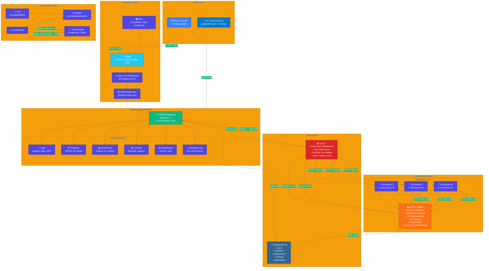
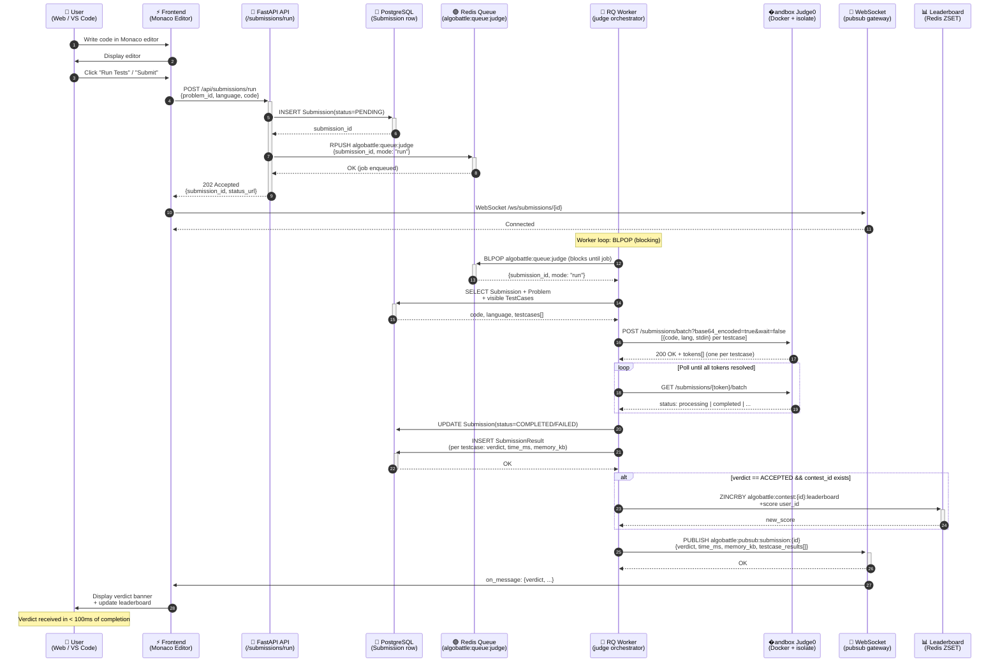
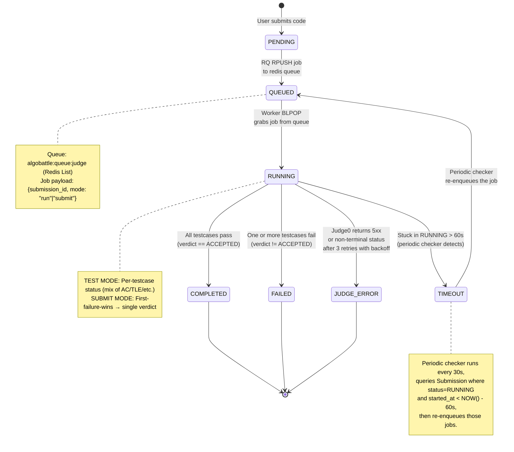
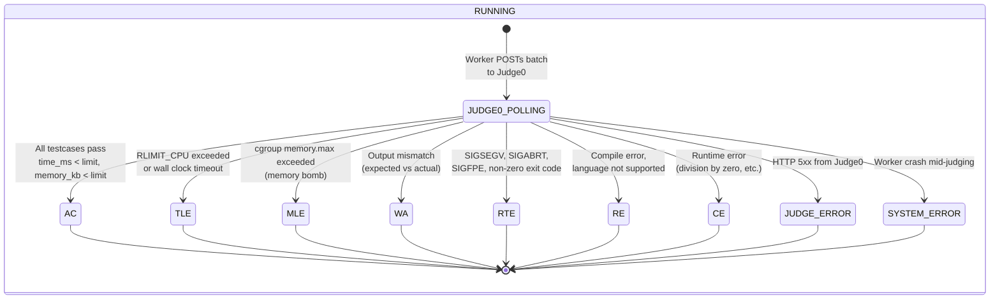
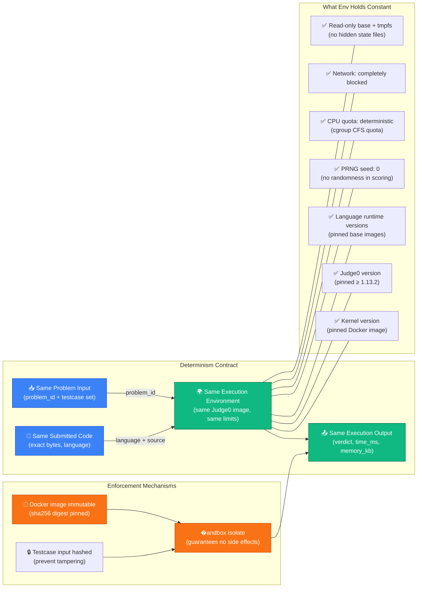
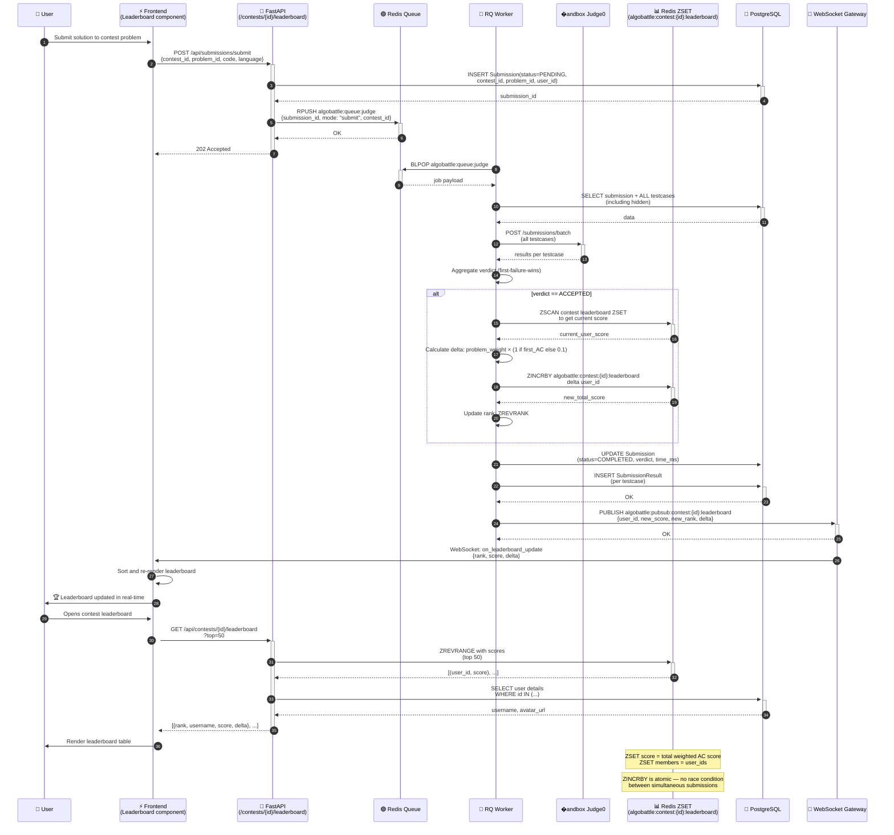
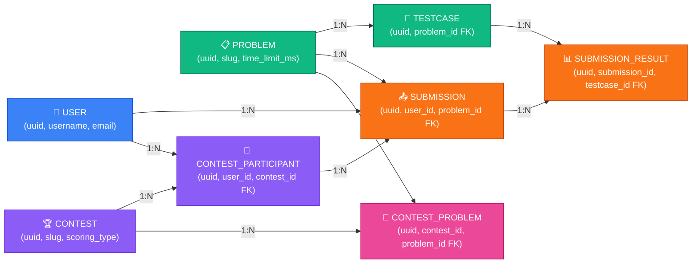
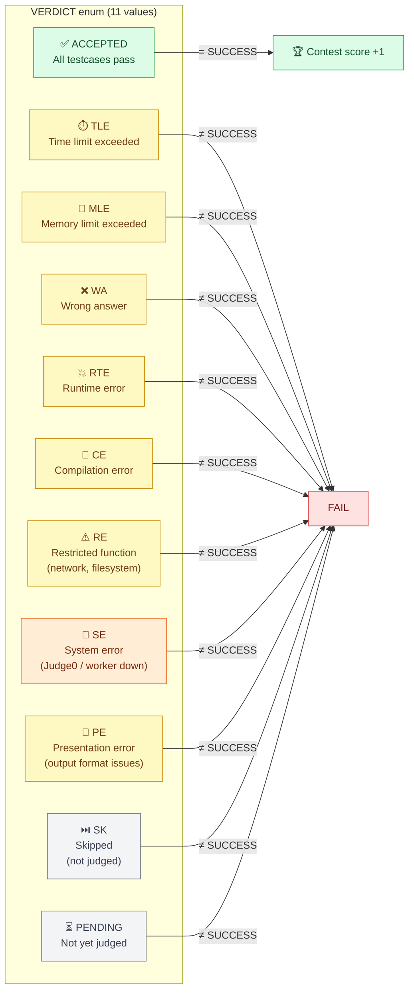

# Algobattle — Architecture Diagrams

This document contains comprehensive Mermaid diagrams illustrating the Algobattle system's architecture, data flows, state machines, security model, and data model. These diagrams are the authoritative visual reference for the project.

---

## 1. System Architecture



### Infrastructure Notes

- **Traefik** handles TLS termination, rate limiting, CORS headers, CSP, X-Frame-Options, and HSTS
- **FastAPI** runs behind gunicorn with 2 Uvicorn worker processes; each worker has its own async event loop
- **RQ Workers** run `--concurrency 4` (4 simultaneous jobs per process); multiple worker processes may be started for higher throughput
- **Judge0** runs as an isolated Docker container with `isolate` (the IOI sandbox), `runAsNonRoot`, `seccomp: RuntimeDefault`, and no network access

---

## 2. Data Flow Diagram — End-to-End Submission



---

## 3. Submission Lifecycle — State Machine



### Verdict Transitions Under RUNNING



---

## 4. Security Model

### 4a. Sandboxing Layers

```mermaid
flowchart TB
    subgraph "Defense in Depth — Sandbox Layers"
        direction TB

        L1["🔒 Layer 1: RLIMIT_CPU\nCPU time limit per process\n• soft limit: problem time limit\n• hard limit: 2× time limit\n• SIGXCPU → TLE verdict"]

        L2["🔒 Layer 2: RLIMIT_FSIZE\nMax file size per process\n• limits output writing\n• prevents disk-filling attacks\n• SIGXFSZ → RTE verdict"]

        L3["🔒 Layer 3: Wall Clock Monitor\n(separate watchdog thread)\n• hard cap: time_limit × 2 + 5s\n• catches CPU + I/O loops\n• SIGKILL → TLE verdict"]

        L4["🔒 Layer 4: cgroup Memory Limits\ncgroup v2 memory.max\n• hard cap: problem memory limit\n• OOM killer → SIGKILL → MLE verdict"]

        L5["🔒 Layer 5: isolate (IOI Sandbox)\n• PIDs: max 64\n• fds: max 1024\n• no network (NET none)\n• tmpfs for /tmp (per-job)\n• read-only filesystem\n• no symlinks (CVE-2024-28185 patched)\n• seccomp: RuntimeDefault\n• caps: no CAP_SYS_ADMIN"]

        L6["🔒 Layer 6: Docker Container Isolation\n• non-root user (UID 65534)\n• read-only root filesystem\n• no-cap-add\n• tmpfs for /tmp\n• network: none\n• memory: problem limit + 50MB overhead"]

        L7["🔒 Layer 7: Judge0 Network Isolation\n• Judge0 container has no network\n• Worker connects via Docker socket\n• Filesystem: overlayfs (scratch)"]
    end

    L1 --> L2 --> L3 --> L4 --> L5 --> L6 --> L7

    style L1 fill:#DC2626,stroke:#991B1B,color:#fff
    style L2 fill:#EA580C,stroke:#9A3412,color:#fff
    style L3 fill:#D97706,stroke:#92400E,color:#fff
    style L4 fill:#CA8A04,stroke:#854D0E,color:#fff
    style L5 fill:#16A34A,stroke:#166534,color:#fff
    style L6 fill:#0D9488,stroke:#115E59,color:#fff
    style L7 fill:#4F46E5,stroke:#3730A3,color:#fff

    note over L1,L7: Each layer is independent —<br/>if one fails, the next catches it
```

### 4b. JWT Authentication Flow

```mermaid
sequenceDiagram
    participant BROWSER as 🌐 Browser<br/>(localStorage / JS)
    participant VSCODE as ⚡ VS Code<br/>(SecretStorage)
    participant API as 🚀 FastAPI API<br/>(/auth/*)
    participant PG as 🐘 PostgreSQL<br/>(users table)
    participant SECRET as 🔐 JWT Secret<br/>(rotating-secret env)

    %% Registration
    BROWSER->>+API: POST /auth/register<br/>{username, email, password}
    API->>+PG: INSERT INTO users<br/>(hashed with bcrypt)
    PG-->>-API: user_id
    API->>+SECRET: Sign JWT<br/>(sub=user_id, exp=7d)
    SECRET-->>-API: access_token
    API-->>-BROWSER: {access_token, user}

    %% Login
    BROWSER->>+API: POST /auth/login<br/>{email, password}
    API->>+PG: SELECT WHERE email
    PG-->>-API: user row + bcrypt_hash
    API->>API: bcrypt.verify(password, hash)
    API->>+SECRET: Sign JWT<br/>(sub=user_id, exp=7d)
    SECRET-->>-API: access_token
    API-->>-BROWSER: {access_token, user}

    %% Authenticated request
    BROWSER->>+API: GET /problems<br/>Authorization: Bearer <token>
    API->>+SECRET: Verify & decode JWT
    SECRET-->>-API: {sub: user_id, exp, ...}
    alt token valid & not expired
        API-->>-BROWSER: 200 {problems: [...]}
    else token expired
        API-->>-BROWSER: 401 Unauthorized<br/>{detail: "Token expired"}
    else token invalid
        API-->>-BROWSER: 401 Unauthorized<br/>{detail: "Invalid token"}
    end

    %% VS Code extension flow
    Note over VSCODE: algobattle.login command
    VSCODE->>+API: POST /auth/login<br/>{email, password}
    API-->>-VSCODE: {access_token}
    VSCODE->>VSCODE: Store in SecretStorage<br/>(macOS Keychain / Windows DPAPI / Linux libsecret)<br/>NOT localStorage
    Note over VSCODE: algobattle.runTests command
    VSCODE->>+API: POST /submissions/run<br/>Authorization: Bearer <token><br/>(fetched from SecretStorage)
    API-->>-VSCODE: 202 Accepted

    %% Secret rotation
    Note over SECRET: On container restart,<br/>rotating-secret refreshes JWT_SECRET env var
    SECRET->>API: New secret loaded
    Note over API: Old tokens remain valid<br/>until expiry (stateless JWT)
```

---

## 5. Determinism Guarantees



### Scoring Determinism

```mermaid
flowchart LR
    A["Same AC submission"] --> B1["Test run 1\ntime_ms: 45ms"]
    A --> B2["Test run 2\ntime_ms: 43ms"]
    A --> B3["Test run 3\ntime_ms: 46ms"]

    B1 --> C["Min of all runs = 43ms"]
    B2 --> C
    B3 --> C

    C --> D["Score = max(0, 100 × (T - t) / T)\nwhere T = problem time limit"]
    D --> E["🏆 Leaderboard score"]

    Note over C,D: We take the BEST (minimum)<br/>execution time across runs,<br/>NOT the average, to reward<br/>consistent fast code
```

---

## 6. Contest Leaderboard Flow



---

## 7. Database Schema — ER Diagram

```mermaid
erDiagram
    USER ||--o{ SUBMISSION : "submits"
    USER {
        uuid id PK
        string username UK
        string email UK
        string password_hash
        timestamp created_at
        timestamp updated_at
        boolean is_active
    }

    PROBLEM ||--o{ TESTCASE : "has"
    PROBLEM ||--o{ SUBMISSION : "receives"
    PROBLEM ||--o{ CONTEST_PROBLEM : "belongs to"
    PROBLEM {
        uuid id PK
        string slug UK
        string title
        text description
        string difficulty
        integer time_limit_ms
        integer memory_limit_kb
        jsonb input_schema
        jsonb output_schema
        jsonb solution_template
        boolean is_public
        timestamp created_at
        timestamp updated_at
    }

    TESTCASE ||--o{ SUBMISSION_RESULT : "validates"
    TESTCASE {
        uuid id PK
        uuid problem_id FK
        text stdin
        text expected_stdout
        text expected_stderr
        integer weight
        boolean is_sample
        boolean is_hidden
        integer time_limit_ms
        integer memory_limit_kb
        timestamp created_at
    }

    SUBMISSION ||--o| CONTEST_PARTICIPANT : "belongs to"
    SUBMISSION ||--o{ SUBMISSION_RESULT : "produces"
    SUBMISSION {
        uuid id PK
        uuid user_id FK
        uuid problem_id FK
        uuid contest_participant_id FK "nullable"
        string language
        text source_code
        string status
        string verdict
        integer total_time_ms
        integer total_memory_kb
        timestamp submitted_at
        timestamp judged_at
        string mode "run | submit"
    }

    SUBMISSION_RESULT {
        uuid id PK
        uuid submission_id FK
        uuid testcase_id FK
        string verdict
        integer time_ms
        integer memory_kb
        text stdout
        text stderr
        text compile_output
        timestamp created_at
    }

    CONTEST ||--o{ CONTEST_PARTICIPANT : "has"
    CONTEST ||--o{ CONTEST_PROBLEM : "contains"
    CONTEST {
        uuid id PK
        string slug UK
        string title
        text description
        timestamp starts_at
        timestamp ends_at
        string scoring_type "ICPC | ioi | custom"
        boolean is_public
        timestamp created_at
    }

    CONTEST_PARTICIPANT ||--o| USER : "represents"
    CONTEST_PARTICIPANT ||--o| CONTEST : "enrolled in"
    CONTEST_PARTICIPANT ||--o{ SUBMISSION : "submits"
    CONTEST_PARTICIPANT {
        uuid id PK
        uuid user_id FK
        uuid contest_id FK
        timestamp joined_at
        integer total_score
        integer rank
    }

    CONTEST_PROBLEM ||--o| PROBLEM : "references"
    CONTEST_PROBLEM ||--o| CONTEST : "belongs to"
    CONTEST_PROBLEM {
        uuid id PK
        uuid contest_id FK
        uuid problem_id FK
        integer order_index
        integer points
    }

    %% Index annotations
    note right of SUBMISSION::status
        Index: (problem_id, status)
        Index: (user_id, problem_id)
        Index: (contest_participant_id, submitted_at)
    end note

    note right of TESTCASE::stdin
        Index: (problem_id, is_hidden)
    end note

    note right of CONTEST_PARTICIPANT::rank
        Index: (contest_id, total_score DESC)
    end note
```

### Table Relationships Summary



---

## 8. Disruption Handling

```mermaid
flowchart TB
    subgraph "Disruption Types"
        direction TB

        %% Row 1: Infinite loops
        DISRUPT1["♾️ Infinite Loop\n(while True: pass)"]
        DISRUPT2["📈 Memory Bomb\n(malloc until OOM)"]
        DISRUPT3["💥 Segmentation Fault\n(null pointer deref)"]
        DISRUPT4["🧮 Division by Zero\n(raise SIGFPE)"]
        DISRUPT5["⏱️ Wall Clock Timeout\n(10× time limit + overhead)"]
        DISRUPT6["🌐 Network Access Attempt\n(curl / socket.connect)"]
        DISRUPT7["📁 Filesystem Escape\n(symlink to /etc/passwd)"]
        DISRUPT8["💾 Disk Fill\n(write infinite bytes)"]
        DISRUPT9["🔧 Judge0 HTTP Error\n(500 / timeout / crash)"]
        DISRUPT10["👷 Worker Crash\n(kill -9 mid-judging)"]
    end

    %% Detection layer
    subgraph "Detection Mechanisms"
        DET1["⏱️ RLIMIT_CPU\nSIGXCPU after soft limit"]
        DET2["🔒 cgroup memory.max\nOOM killer → SIGKILL"]
        DET3["🛡️ isolate SIGSEGV\ncaught by sandbox"]
        DET4["🛡️ isolate SIGFPE\ncaught by sandbox"]
        DET5["🐕 Watchdog Thread\nseparate process, wall clock"]
        DET6["🌍 isolate NET none\nconnection refused"]
        DET7["🛡️ isolate --no-symlink\nCVE-2024-28185 patched\n(Judge0 ≥ 1.13.2)"]
        DET8["🔒 RLIMIT_FSIZE\nSIGXFSZ → RTE"]
        DET9["🔄 Retry 3× with backoff\nthen → JUDGE_ERROR"]
        DET10["🔄 Periodic checker\n(stuck > 60s → re-enqueue)"]
    end

    %% Verdict mapping
    subgraph "Verdict Output"
        V1["⏱️ TLE — Time Limit Exceeded"]
        V2["💾 MLE — Memory Limit Exceeded"]
        V3["💥 RTE — Runtime Error\n(SIGSEGV)"]
        V4["💥 RTE — Runtime Error\n(SIGFPE)"]
        V5["⏱️ TLE — Time Limit Exceeded\n(wall clock)"]
        V6["💥 RTE — Runtime Error\n(network I/O)"]
        V7["💥 RTE — Runtime Error\n(filesystem violation)"]
        V8["💥 RTE — Runtime Error\n(disk limit)"]
        V9["⚠️ JUDGE_ERROR — Judge system failure"]
        V10["⚠️ JUDGE_ERROR → re-enqueued\n→ eventually RUNNING → COMPLETED"]
    end

    %% Connections
    DISRUPT1 --> DET1
    DISRUPT1 --> DET5
    DET1 --> V1
    DET5 --> V1

    DISRUPT2 --> DET2
    DET2 --> V2

    DISRUPT3 --> DET3
    DET3 --> V3

    DISRUPT4 --> DET4
    DET4 --> V4

    DISRUPT5 --> DET5
    DET5 --> V5

    DISRUPT6 --> DET6
    DET6 --> V6

    DISRUPT7 --> DET7
    DET7 --> V7

    DISRUPT8 --> DET8
    DET8 --> V8

    DISRUPT9 --> DET9

    DISRUPT10 --> DET10
    DET10 --> V10

    %% Style
    style DISRUPT1 fill:#FEE2E2,stroke:#DC2626,color:#7F1D1D
    style DISRUPT2 fill:#FEE2E2,stroke:#DC2626,color:#7F1D1D
    style DISRUPT3 fill:#FEE2E2,stroke:#DC2626,color:#7F1D1D
    style DISRUPT4 fill:#FEE2E2,stroke:#DC2626,color:#7F1D1D
    style DISRUPT5 fill:#FEF3C7,stroke:#D97706,color:#78350F
    style DISRUPT6 fill:#FEE2E2,stroke:#DC2626,color:#7F1D1D
    style DISRUPT7 fill:#FEE2E2,stroke:#DC2626,color:#7F1D1D
    style DISRUPT8 fill:#FEE2E2,stroke:#DC2626,color:#7F1D1D
    style DISRUPT9 fill:#FEF3C7,stroke:#D97706,color:#78350F
    style DISRUPT10 fill:#FEF3C7,stroke:#D97706,color:#78350F

    style V1 fill:#FEF9C3,stroke:#CA8A04,color:#713F12
    style V2 fill:#FEF9C3,stroke:#CA8A04,color:#713F12
    style V3 fill:#FEF9C3,stroke:#CA8A04,color:#713F12
    style V4 fill:#FEF9C3,stroke:#CA8A04,color:#713F12
    style V5 fill:#FEF9C3,stroke:#CA8A04,color:#713F12
    style V6 fill:#FEF9C3,stroke:#CA8A04,color:#713F12
    style V7 fill:#FEF9C3,stroke:#CA8A04,color:#713F12
    style V8 fill:#FEF9C3,stroke:#CA8A04,color:#713F12
    style V9 fill:#FFEDD5,stroke:#EA580C,color:#7C2D12
    style V10 fill:#FFEDD5,stroke:#EA580C,color:#7C2D12
```



### Verdict Enum Reference



---

*Generated from `ARCHITECTURE.md` — all diagrams use Mermaid syntax and render in any Mermaid-compatible viewer (GitHub, GitLab, VS Code Mermaid Preview, mermaid.live).*
